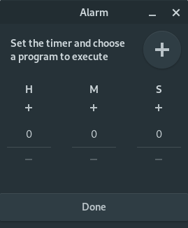

# Alarm-rs

Execute a program after a set amount of time. (via `xdg-open` on linux, and `start` on windows)

Made to play with gtk-rs.

# Usage 

Follow these steps [https://gtk-rs.org/docs-src/requirements.html](https://gtk-rs.org/docs-src/requirements.html) to setup the build environment then use

```console
cargo run --release
```

# How it looks like


